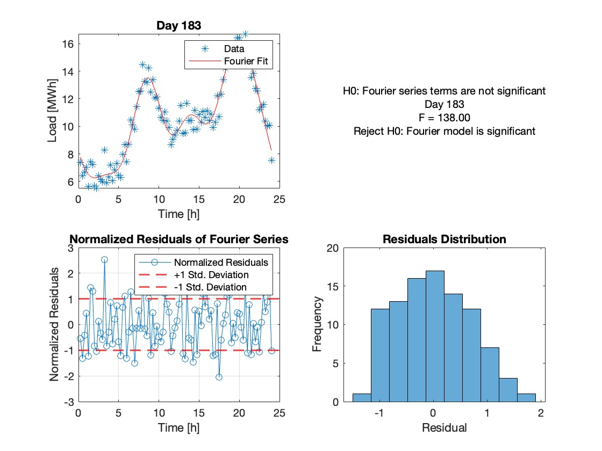
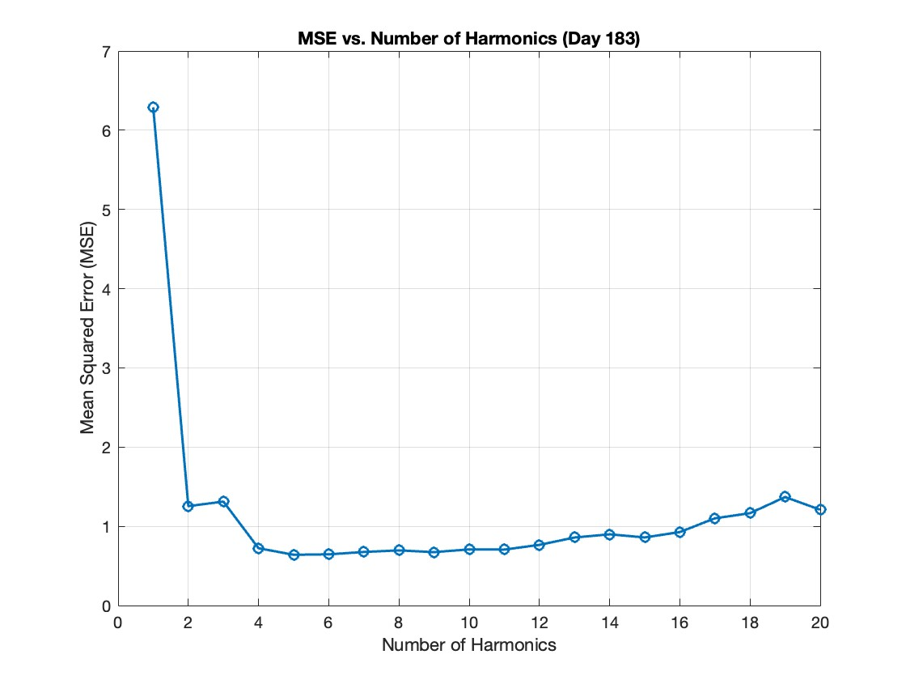

# Fourier Series for Residential Electrical Load Prediction

This repository contains the Fourier Series part of a Statistical Learning Theory project focused on predicting residential electrical load.  

---

## Project Overview
- **Goal:** Predict the electrical load for 4 different days of the year.
- **Data:**
  - `X1` = Day of the year
  - `X2` = Hour of the day
  - `Y` = Electrical load (response)
- **Method:**
  - Model the periodic behavior of the load using a Fourier Series (sum of sines and cosines).
  - Determine the optimal number of harmonics using K-Fold Cross-Validation (K=5).
 
---

## Results
- **Optimal Harmonics:** 6  
- **K-Fold CV Test MSE:** 0.5560  
- **MSE on Full Data:** 0.4361  

These results show that the Fourier Series can effectively capture periodic patterns in the load data.

## Visualized Results for Day 183

---

---

## Features
- MATLAB implementation using `FourFit` and `FourVal` functions
- K-Fold Cross-Validation for harmonic selection
- Example workflow for training, validation, and evaluation
